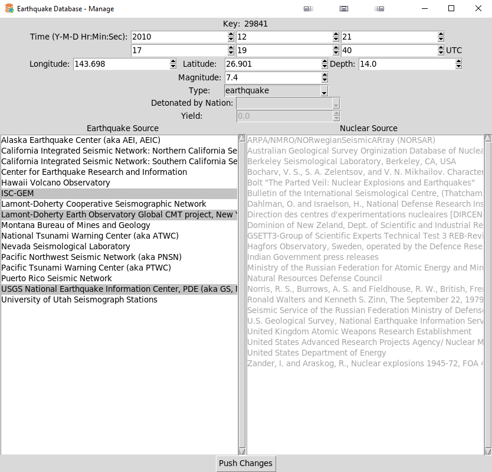
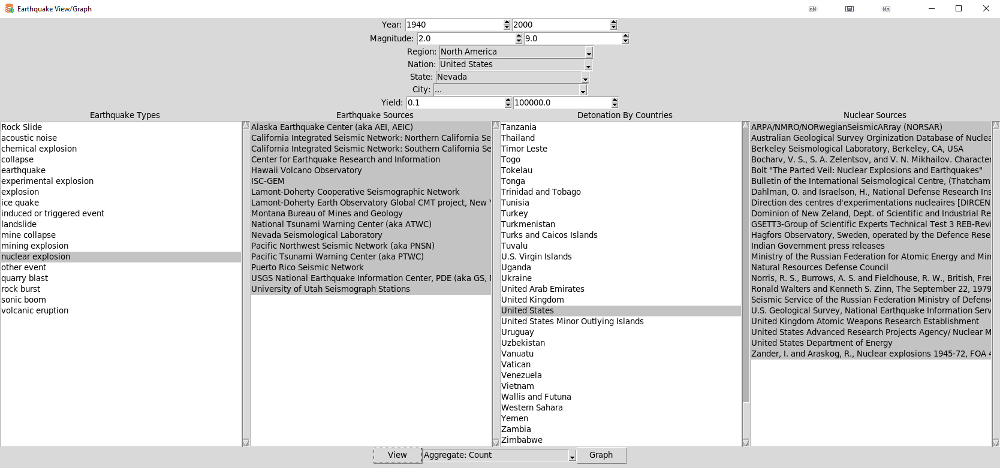
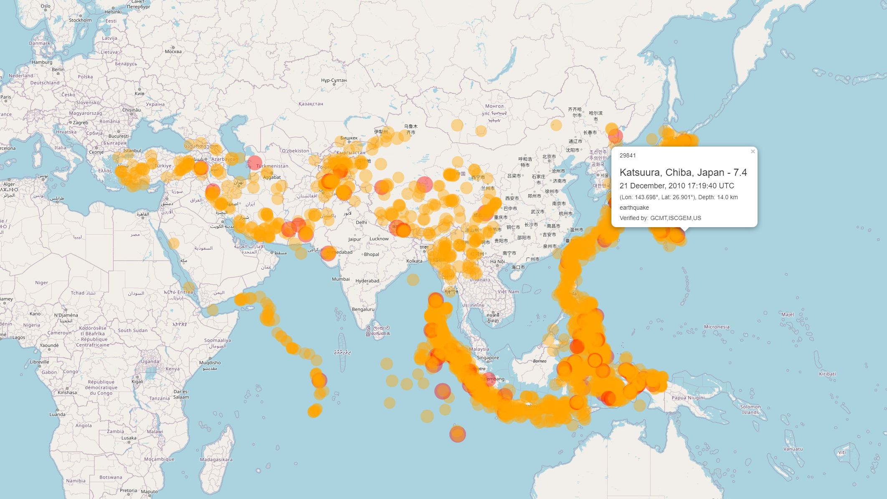
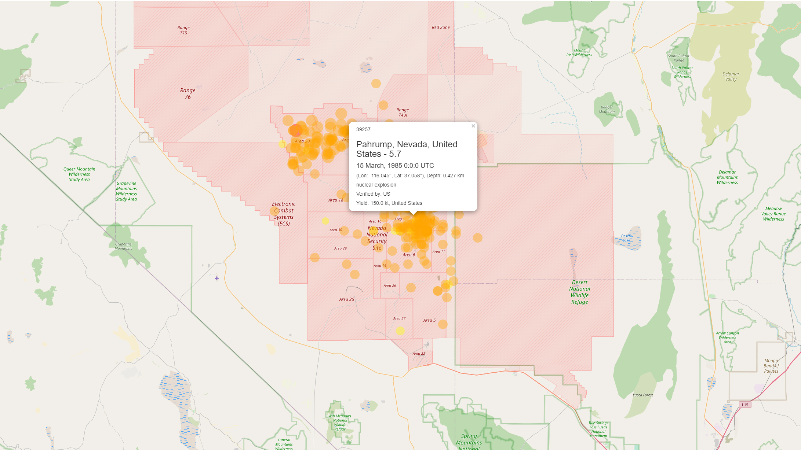
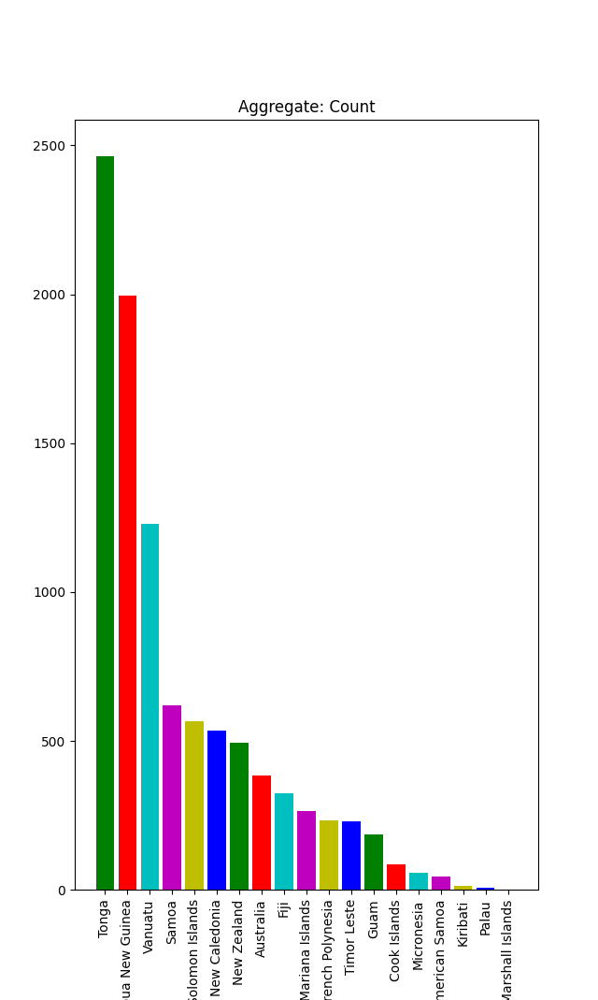

# Earthquake Database

Project - Phase 3

## Setup

- Install Tk - 
[Tk Install Page](https://tkdocs.com/tutorial/install.html)

- Use pip to install the required packages
```
pip install numpy
pip install pandas
pip install matplotlib
pip install folium
```

## Usage

- Generate a map of the Earthquakes from a set of filter options or a graph
```
./EarthquakeDB.sh view
```

- Insert a new Earthquake
```
./EarthquakeDB.sh edit
```

- Edit an existing Earthquake using its key
```
./EarthquakeDB.sh edit "key"
```

## Additional Notes

- Maps generated into [output/](output/)

- Earthquake key can be found at the top left of the popup when viewing a map

- There is a backup copy of the data if it needs to be reset
```
cp src/Data/backup/data-backup.sqlite src/Data/backup/data.sqlite
```

- Screenshots in [screenshots/](screenshots/) and Sample Maps in [output/sample/](output/sample/)

## Screenshots










